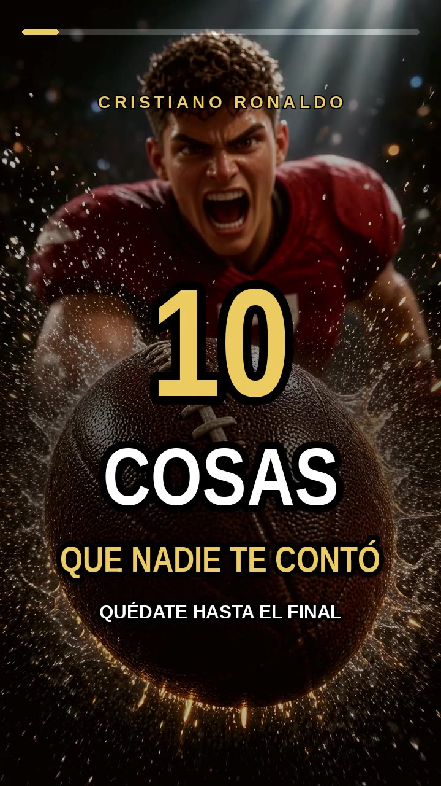
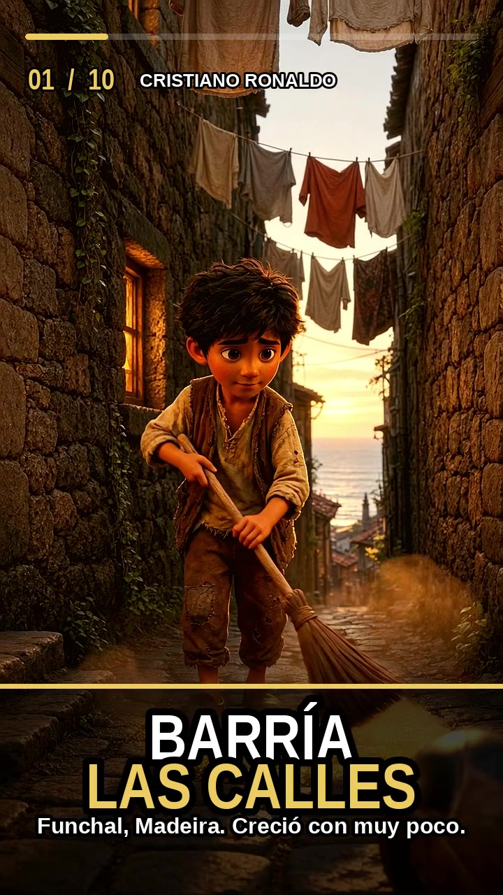
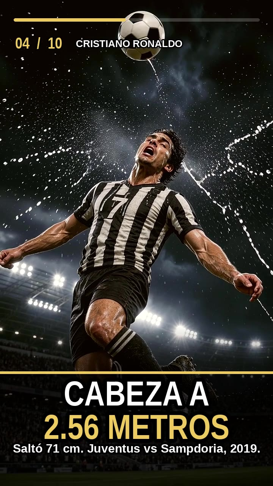
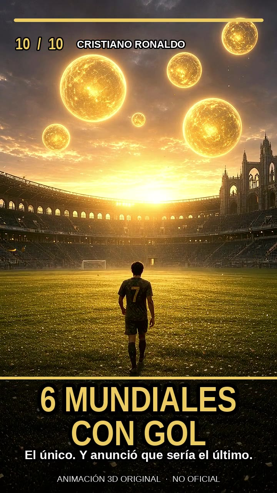

# 10 cosas que nadie te contó de Cristiano Ronaldo

Video vertical para TikTok. Animación 3D cinematográfica, épica, con narración en español y música original.

| | |
|---|---|
| Duración | **2:45** |
| Formato | **9:16** (720×1280, 24 fps) |
| Audio | Narración en español + score épico |
| Archivo | [cristiano-10-cosas-tiktok.mp4](cristiano-10-cosas-tiktok.mp4) |

## Los 10 hechos

1. **De niño barría las calles.** Nació en Funchal, Madeira, y creció en un entorno económicamente difícil. Ayudaba a su familia barriendo las calles.
2. **Entrenaba con pesas en los tobillos.** En sus primeros años en el Manchester United practicaba las bicicletas con pesas para que en el partido le resultaran más fáciles.
3. **Competitivo también en el ping-pong.** Patrice Evra contó que, tras perder contra Rio Ferdinand, entrenó dos semanas, pidió la revancha y lo venció.
4. **Un remate de cabeza a 2.56 m.** En 2019, con la Juventus contra el Sampdoria, saltó unos 71 cm para marcar.
5. **Máximo goleador histórico del Real Madrid.** 450 goles en 438 partidos.
6. **100 goles con cuatro clubes.** El primero en llegar a esa cifra con Manchester United, Real Madrid, Juventus y Al Nassr.
7. **Un hat-trick cada año, 15 años seguidos.** De 2010 a 2024. En 2011 consiguió nueve.
8. **El primer Premio Puskás.** 2009, por un disparo de larga distancia contra el Porto en la Champions.
9. **Récords con la selección y en la Champions.** Máximo histórico masculino de goles y partidos con una selección, y de goles y apariciones en la Champions League.
10. **Gol en seis Copas del Mundo.** Tras el Mundial de 2026, descrito por la FIFA como el único en lograrlo. Anunció que ese sería su último Mundial.

## Nota

Dramatización en animación 3D original, pensada como pieza épica para redes. El personaje es un diseño estilizado de cine de deportes, no es metraje real ni material oficial. Este proyecto no está afiliado a Cristiano Ronaldo, a la FIFA ni a los clubes mencionados.
